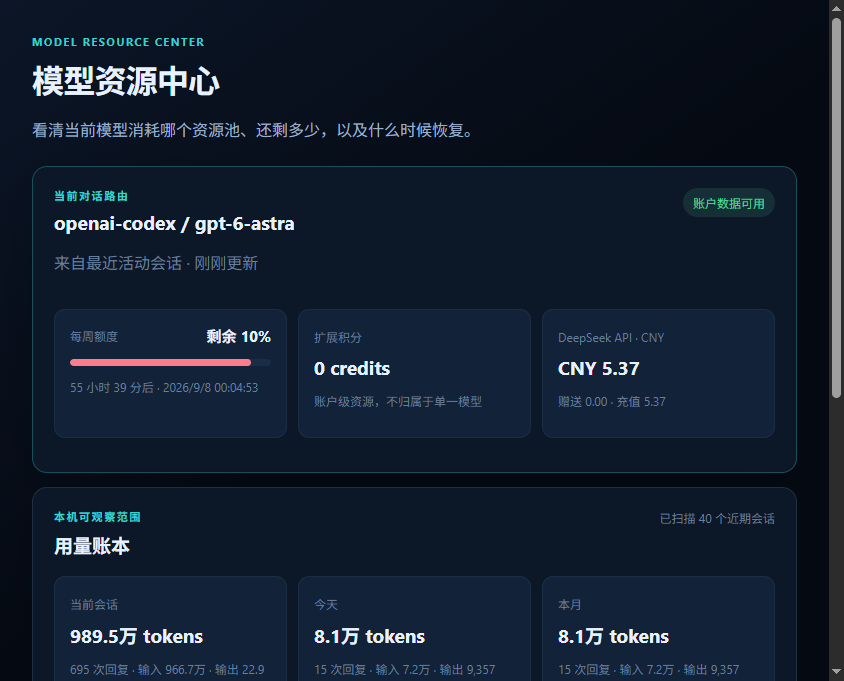

<div align="center">
  
  <h1>DeepSeek Harness Desktop</h1>
  <p><strong>把 DeepSeek Harness 变成一个更适合长期使用的 Windows AI Agent 工作台。</strong></p>
  <p>多 Provider · 模型资源中心 · 原生会话管理 · 本地桌面体验</p>
  <p><a href="https://github.com/yijigao/deepseek-harness-desktop/releases/download/v2.2.0/DeepSeek-Setup-2.2.0.exe"><strong>下载 v2.2.0 安装版</strong></a> · <a href="https://github.com/yijigao/deepseek-harness-desktop/releases/tag/v2.2.0">版本说明</a></p>
  <p>
    <a href="https://github.com/yijigao/deepseek-harness-desktop/releases/latest"></a>
    <a href="https://github.com/yijigao/deepseek-harness-desktop/releases"></a>
    <a href="https://github.com/yijigao/deepseek-harness-desktop/stargazers"></a>
    
    <a href="LICENSE"></a>
  </p>
</div>

DeepSeek Harness Desktop 是由社区维护的 Windows AI Agent 工作台。它保留 Harness 原生的工作区、模型、插件、Agent 预设和权限体系，并补齐长期桌面使用所需的运行可靠性、模型接入、资源可见性和原生交互；它并非只把 `dsh web` 放进 Electron 窗口。

## 为什么它不只是一个桌面壳

- **多 Provider / OpenAI-compatible**：复用 Harness Provider 架构，提供 OpenAI-compatible Provider 配置能力，以及 ChatGPT subscription OAuth 路由和第三方 Provider 配置示例。
- **模型资源中心**：Provider 支持时显示真实账户用量、余额和重置时间；不支持时明确降级为本地 Token 观察，不伪造 Provider 数据。
- **原生桌面能力**：提供会话置顶、原生剪贴板、独立窗口和本地运行时管理，并尽量在数据层或源码层集成，避免依赖脆弱的 DOM hack。
- **受控成品包升级**：旧源码更新入口已退役。新流程校验固定发布包，区分桌面、引擎和数据格式更新；运行中的任务不会被自动停止，启动后的失败不会触发不安全降级。线上自动下载渠道尚未配置，详见[发布流程](docs/release-updates.md)。

> [!TIP]
> 如果这个项目让 DeepSeek Harness 更好用，欢迎点一个 **Star**，帮助更多人发现它。

> [!IMPORTANT]
> 本项目为非官方社区项目，不代表 DeepSeek 官方立场。

## v2.2.0 有什么新功能

- **原生会话置顶**：在会话菜单中置顶或取消置顶，结果持久保存。排序发生在 React 数据层，不使用 DOM 轮询、观察器或后台扫描。
- **模型资源中心**：顶部常驻显示当前模型，并统一展示 ChatGPT 订阅配额、DeepSeek API 余额和本机 Token 用量；服务不可用时自动降级，不阻塞会话。
- **完整桌面体验**：独立窗口、原生窗口控制、共享现有 Harness 配置和会话，关闭应用时同步回收本地服务。


## 快速开始

1. 从 [Releases](https://github.com/yijigao/deepseek-harness-desktop/releases/latest) 下载安装版或便携版。
2. 安装并启动 DeepSeek Harness Desktop。
3. 继续使用原有 `DSH_HOME`（默认 `%USERPROFILE%\.dsh`）中的设置和会话。

应用只在 `127.0.0.1` 的随机端口启动 `dsh web`。账号凭据、历史会话、日志和本地配置不会被复制进项目目录。

## 会话置顶

在任意会话的菜单中选择“置顶会话”。空白的新会话始终位于最前，其后是已置顶会话，再后是普通会话。最多保存 50 个置顶会话 ID，避免长期使用造成无界增长。

该功能直接作用于会话数据层，没有 `MutationObserver`、定时器、页面扫描或额外子进程，设计目标是让长会话列表仍保持流畅。

## 模型资源中心

模型资源中心优先读取提供商返回的真实账户信息，在一个面板中展示当前会话路由、ChatGPT 订阅配额及恢复时间、DeepSeek API 人民币余额，以及当前会话、今日和本月的本机 Token 用量。若提供商不开放账户数据，则明确降级为本机 Token 统计，不伪造“余额”。账户探测和会话统计均在后台执行，不阻塞主界面启动与操作。



截图中的模型、配额和余额来自当前部署示例，不代表固定的产品限制或默认账户数据。

## 设置与兼容性


桌面版保留工作区、模型、插件、Agent 预设、权限和语言等 Harness 原生能力，并直接复用现有 `DSH_HOME`。[`config-example/`](config-example/README.md) 提供多提供商与 ChatGPT 订阅 OAuth 路由的配置示例；仓库不包含任何真实凭据。

## Provider integrations

DeepSeek Harness Desktop reuses the Harness provider architecture. OpenAI-compatible providers can be added as optional providers without rewriting the Agent, session, or tool layers.

Model/API providers interested in tested integration, onboarding, documentation, resource or usage visibility where APIs support it, or release collaboration can contact the project through a [GitHub Issue](https://github.com/yijigao/deepseek-harness-desktop/issues).

## 本地开发

要求 Node.js 22.15+：

```powershell
cd app
npm ci
npm start
```

运行测试：

```powershell
cd app
npm test
```

开发模式需要预先准备 `staging/payload/runtime` 和 `staging/payload/node.exe`，它们来自上游 DeepSeek Harness，不提交到本仓库。

Harness Lab 已从当前源码的日常界面、启动流程和发布包移除；不会删除历史会话，也不影响模型资源用量统计。旧版截图可能仍显示该按钮，已发布的旧安装包不会随源码自动变化。轨迹解析器保留用于用量统计和离线回归测试，历史设计见 [归档说明](docs/harness-lab.md)。

轨迹格式的验证范围（不代表业务结果质量已验收）：

> Schema-derived, synthetic-tested, and smoke-validated against a locally generated minimal DeepSeek Harness session.

## 构建

使用固定工具链和已验证的引擎运行时作为构建输入。新的打包入口不合并上游源码，也不读取旧 staging/payload：

```powershell
$env:DSH_RELEASE_RUNTIME = '<已验证的运行时目录>'
$env:DSH_RELEASE_NODE = '<固定版本的 node.exe>'
cd app
npm ci
npm run dist
```

安装版与便携版生成在 `release-artifacts/<releaseId>/`，不覆盖已封装的旧发布。固定引擎提交、可重放源码补丁及发布约定保存在 `maintenance/`。全新源码到分发运行时的完整复现仍待验证，不把现有运行时打包等同于源码构建完成。

安装需要当前包与新包的可信清单 SHA256。候选先隔离验证，Desktop 未关闭则拒绝切换；跨会话格式更新不走普通安装路径。具体封装、准备、安装命令及回退边界见[发布流程](docs/release-updates.md)。

## 隐私与安全

仓库明确排除以下内容：

- `.dsh`、API 凭据、OAuth Token、登录状态与历史会话；
- 日志、缓存、数据库、本地配置与环境变量文件；
- `node_modules`、运行时、构建产物、签名证书与私钥。

应用只读取你本机的 `DSH_HOME`，不会把这些数据复制到仓库或发送到远程分析服务。

## 许可

桌面端代码采用 [MIT License](LICENSE)。DeepSeek Harness 及其依赖仍分别适用各自的许可证和商标条款；分发包含上游运行时的安装包前，请自行核对对应许可。
