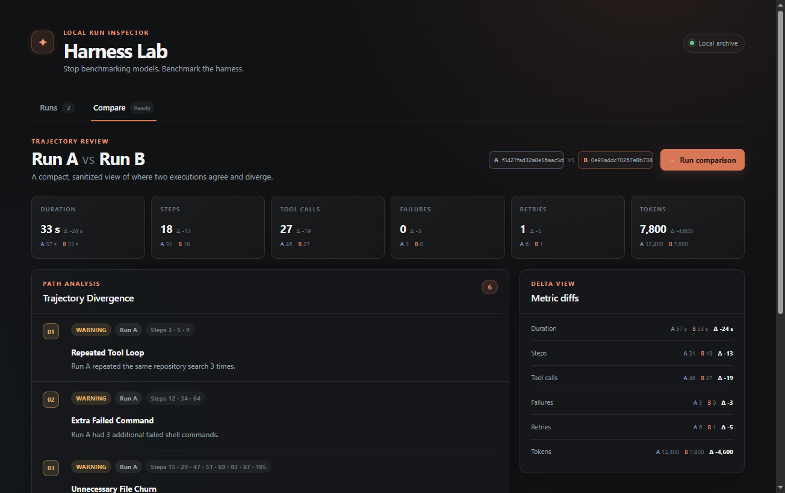
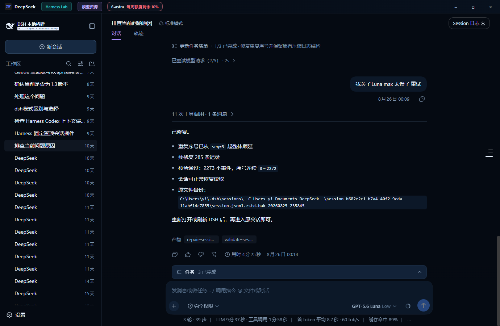
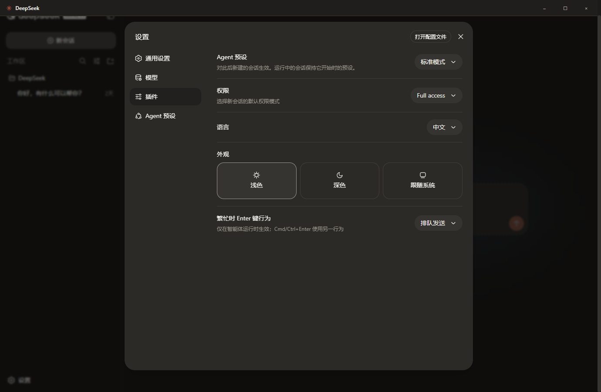

<div align="center">
  
  <h1>DeepSeek Harness Desktop</h1>
  <p><strong>Stop benchmarking models. Benchmark the harness.</strong></p>
  <p>Compare execution trajectories across DeepSeek Harness runs — locally, side by side.</p>
  <p>
    <a href="https://github.com/yijigao/deepseek-harness-desktop/releases/download/v1.2.0/DeepSeek-Setup-1.2.0.exe"><strong>Download v1.2.0 for Windows</strong></a>
    ·
    <a href="https://github.com/yijigao/deepseek-harness-desktop/releases/tag/v1.2.0">Release notes</a>
  </p>
  <p>
    
    
    
  </p>
</div>

Harness Lab 让你在同一视图中比较两个 run 的执行轨迹：不只看最终答案，还能直接看到 agent 如何完成任务、付出了多少执行成本，以及差异发生在哪里。



> 截图展示内置 Demo Mode 的 **synthetic comparison**。Run A / Run B 数字均为合成 fixture 数据，只用于演示比较流程；它们不是模型性能 benchmark，也不代表任何性能提升。

## Harness Lab

**Compare execution trajectories** and inspect:

- **Steps / tool calls / retries / failures** — quantify execution effort and reliability.
- **Repeated tool loops** — surface duplicated calls detected by deterministic rules.
- **Failed commands** — show command failures and whether a run recovered.
- **Unnecessary file churn** — compare extra file reads, writes, and search paths.
- **Test timing / failure recovery** — see when tests ran and how each run behaved after failure.
- **Local-first privacy** — parsing stays on the local machine; the UI receives sanitized metrics and summaries, not raw prompts, credentials, or absolute paths.

Runs discovers recent sessions and lets you select Run A / Run B. Compare places Duration, Steps, Tool Calls, Failures, Retries, and Tokens beside explainable trajectory divergences.

DeepSeek Harness Desktop 是一个由社区维护的 Windows 桌面封装。它将 [DeepSeek Harness](https://github.com/deepseek-ai/deepseek-harness) 完整的 `dsh web` 运行时与 Web GUI 放进独立 Electron 窗口；Harness Lab 则作为独立的本地 Desktop UI 与 Harness Web 并列运行。

> [!IMPORTANT]
> 这是社区项目，不是 DeepSeek 官方桌面客户端，也不代表 DeepSeek 官方立场。

Harness Lab 使用官方上游 session schema 和完全 synthetic fixtures 建立 MVP 基线。详细字段、兼容性边界与启发式规则见 [Session Format Audit](docs/session-format-audit.md) 和 [Harness Lab MVP](docs/harness-lab.md)。

> Schema-derived, synthetic-tested, and smoke-validated against a locally
> generated minimal DeepSeek Harness session.

## 界面预览

### 专注的桌面工作区



### 完整保留 Harness 设置能力



## 项目亮点

- **双击即用**：将命令行启动流程封装为标准 Windows 应用，安装版和便携版均可构建。
- **原生桌面体验**：独立窗口、自绘标题栏、最小化/最大化/关闭控制，以及经过统一设计的深色主题。
- **完整 Harness 能力**：保留工作区、模型、插件、Agent 预设、权限和语言等原生功能。
- **本机安全运行**：`dsh web` 仅监听 `127.0.0.1` 随机端口；关闭窗口时同步结束服务进程。
- **无缝复用配置**：直接使用现有 `DSH_HOME`（默认 `%USERPROFILE%\.dsh`），命令行版与桌面版共享设置和会话。
- **上游版本感知**：每天最多检查一次 DeepSeek Harness major/minor 更新，并提供源码重建更新流程。
- **可复现构建**：运行时部署、依赖补齐、junction 展平、冒烟测试和 Electron 打包均由脚本完成。
- **隐私优先开源**：源码仓库明确排除账号凭据、历史会话、日志、缓存、签名材料和本机构建产物。
- **Harness Diff**：用确定性指标和规则比较两次执行的工具使用、失败恢复、搜索路径与文件 churn。

## 工作方式

```text
启动桌面应用
    ↓
在本机随机端口启动 dsh web
    ↓
Electron 窗口加载 Web GUI 并注入桌面主题
    ↓
关闭窗口时回收 Harness 子进程
```

## 隐私

仓库只包含桌面壳源码、构建脚本和必要图标，不包含：

- `.dsh`、API 凭据、登录状态或历史会话
- 日志、缓存、数据库和本机配置
- `node_modules`、打包产物、内置运行时或 Node 可执行文件
- 代码签名证书、私钥或环境变量文件

应用会在运行时读取本机的 `DSH_HOME`；这些数据不会被复制到项目目录。

Harness Lab 默认只把经过净化的指标、工具名/类别、通用摘要和文件 basename 发送给本地 renderer。它不会把 Prompt 原文或凭据用于比较，也不会发起远程分析。

## 开发运行

要求 Node.js 22.15+（默认 `.jsonl.zstd` session 使用 Node 内置 Zstandard 解码）：

```powershell
cd app
npm ci
npm start
```

开发模式需要先准备 `staging/payload/runtime` 和 `staging/payload/node.exe`。运行时来自上游 DeepSeek Harness，不提交到本仓库。

### Harness Lab Demo Mode

Demo Mode 完全使用仓库内 synthetic sessions，不需要真实 `DSH_HOME`，也不会启动 `dsh web`：

```powershell
cd app
npm start -- --demo-harness-lab
```

也可以设置 `HARNESS_LAB_DEMO=1`。Demo 固定展示 Run A（31 steps / 46 tool calls / 6 retries / 3 failures）与 Run B（18 steps / 27 tool calls / 1 retry / 0 failures），并突出重复仓库搜索、失败测试恢复与执行量差异。

运行测试：

```powershell
cd app
npm test
```

## 构建

1. 将上游仓库克隆到本机，例如 `..\deepseek-harness`。
2. 安装 `pnpm`，并在上游仓库安装依赖。
3. 运行：

```powershell
powershell -ExecutionPolicy Bypass -File scripts\sync-update.ps1 `
  -Checkout ..\deepseek-harness `
  -BuildOnly
```

生成文件位于 `dist/`。更新脚本不会依赖任何固定用户名或绝对路径。

## 自动更新说明

桌面应用根据打包时生成的 `version.json` 检查上游 DeepSeek Harness 版本。收到 major/minor 更新提示后，更新脚本会拉取用户本机的上游源码、重建运行时并重新打包。该流程需要 Git、Node.js、pnpm 和完整源码工作区，并非下载未知二进制覆盖安装。

## 上游与许可

桌面封装代码以 [MIT License](LICENSE) 发布。DeepSeek Harness 及其依赖仍分别适用各自的许可证和商标条款；分发包含上游运行时的安装包前，请自行核对并遵守对应许可。
